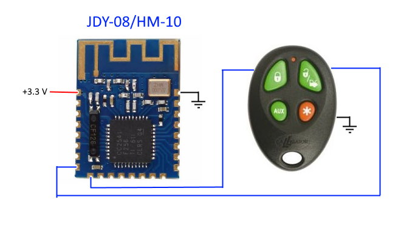
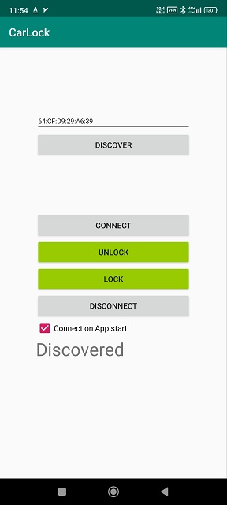

# JDY-08-HM-10-CC2541-remote-controled-by-Android-app
This project I made to open/close my car with Android app(by bluetoth). 
I used JDY-08(CC2541) as bluetooth revceiver and it contols my car alarm backup remote( by giving short pulses(50ms) to open/close buttons of the remote. 
I used BLE-CC254x-1.4.0 TI stack to create CC2541 firmware. Firmware is actively using sleep mode, so power consumption is less 0.5 ma. 
Later I made Android App to send commands to JDY-08. 
App is connecting to JDY-08(by MAC addr) and writing BLE characteristic to open/close my car. 

Main files: 
CC2541 frimware: SimpleBLEPeripheral.bin 
Android App: car_lock.apk
